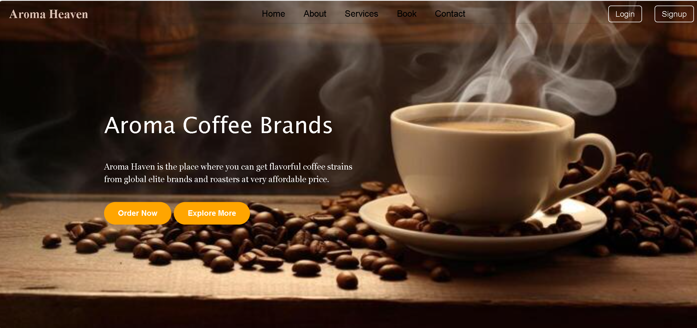
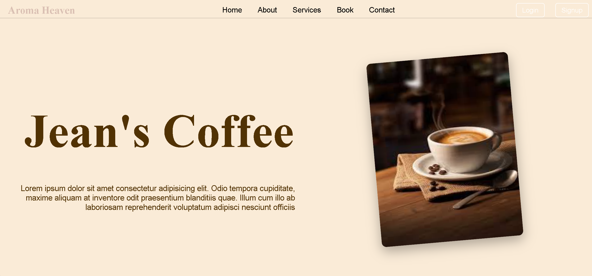
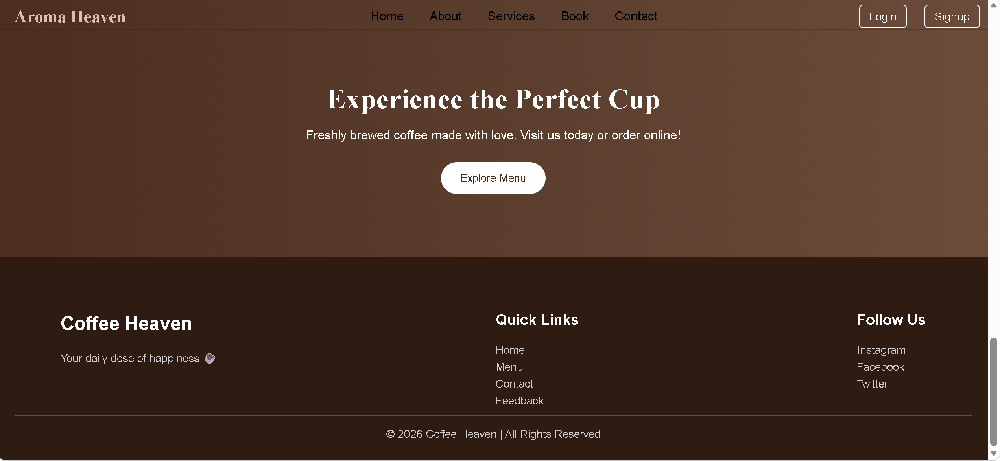
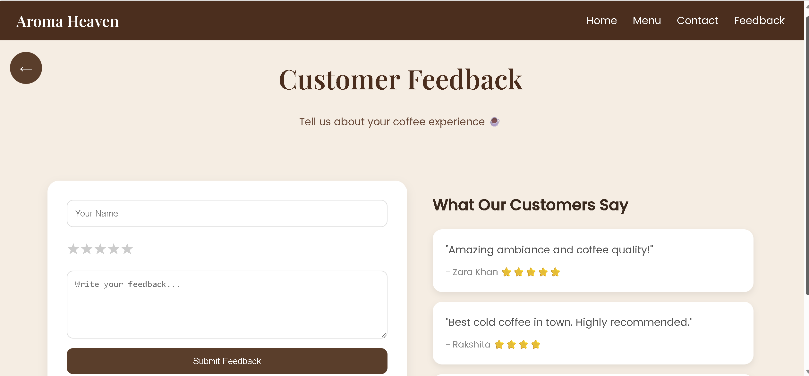
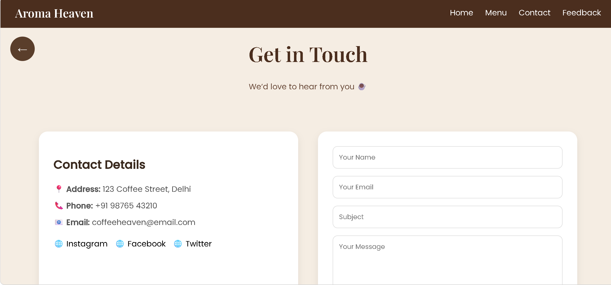
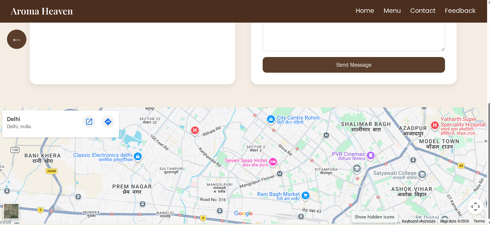

# ☕Aroma Heaven Website

A modern and responsive coffee cafe website built using HTML & CSS.

## 📌 Features
- Beautiful landing page with hero section
- Interactive coffee menu with hover effects
- Table booking page
- Contact form with Google Maps
- Customer feedback system
- Smooth animations and UI design

## 🛠️ Technologies Used
- HTML5
- CSS3
- Google Fonts

## 📂 Project Structure
coffee-cafe-website/
│── index.html
│── menu.html
│── contact.html
│── feedback.html
│── book.html
│── login.html
│── signup.html
│
└── assets/
    ├── espresso.jpg
    ├── latte.jpg
    ├── mocha.jpg
    ├── coffee-bg.jpg
    └── (other images)

  ## 📸 Screenshots
## Home Page
## 📸 Screenshots

## About Page

## Contact Page

## 👩‍💻 Author
Rakshita Gahlawat

## Live link
https://coffee-caf.netlify.app/

---

✨ This project is created for learning and frontend practice.
